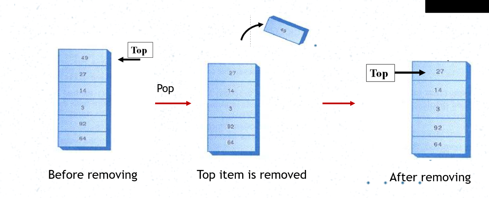

# Stack

- Allows access to only one data item; the last item inserted
- if you remove this item, then you can access next to last item inserted

- In stack all insertions and deletion are made at one end (TOP) 
- Insertions and Deletions are restricted from the middle and at the end of stack 
- Adding an item called Push
- Removing an item called Pop
- Elements are removed from Stack in the reverse order of that in which the elements
were inserted into stack
  
- The elements are inserted and removed according to the LAST-IN-FIRST-OUT (LIFO) Principle

# Stack-Push

# Stack-Pop

# Stack-Peek

# Application of Stack

- String reverse
- Page visited history in web browser
- Undo sequence of text editor
Recursive function calling
- Auxiliary data structure for algorithms
- Stack in memory for process
